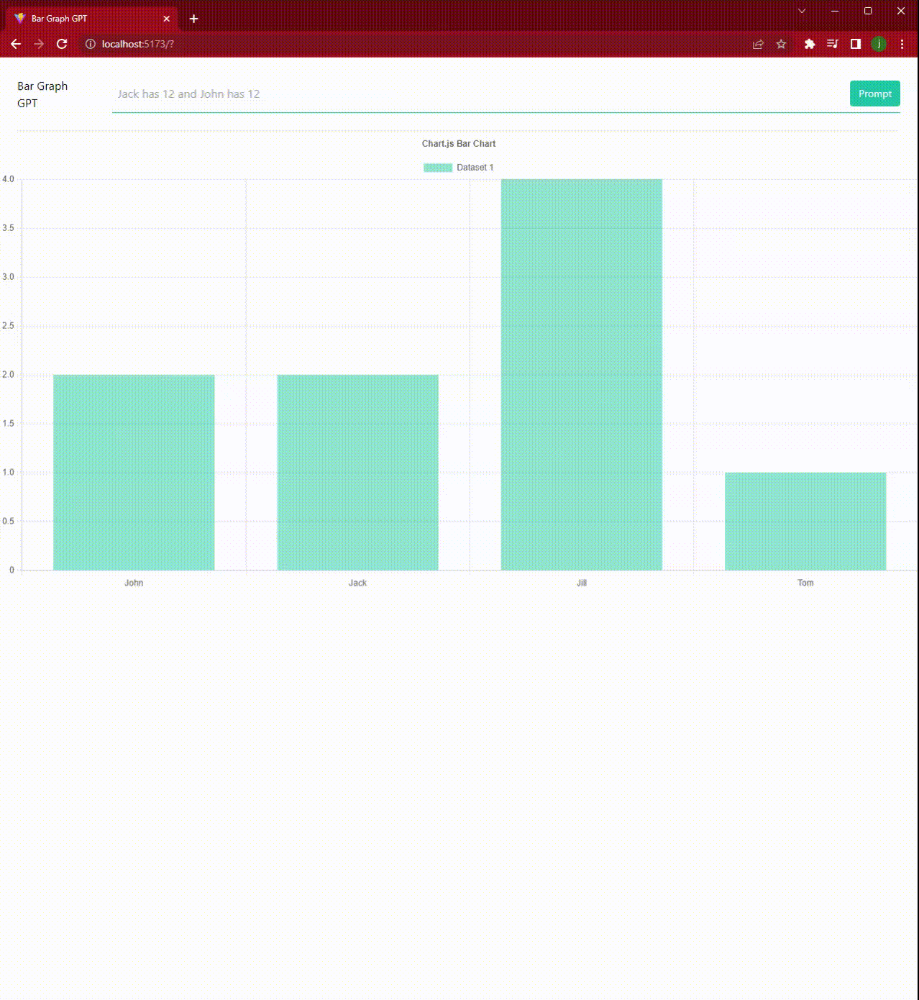

# Bar Graph with GPT

using an initial prompt :
```
Given the current state of a graph and a prompt, extrapolate as much as possible from the prompt and update the state. Every label inside graph has a corresponding value inside datasets.data. Retain all the names and their values as we update.

Examples:
current state:
{ "counter": 1, "graph": {  "labels": ["John", "Jack"],  "datasets": [    {      "label": "Dataset 1", "data": [12, 12], "backgroundColor": "rgba(20, 184, 166, 0.5)"    }  ]} }
prompt: John has 2 and Jill has 3
new state:
{ "counter": 1, "graph": {  "labels": ["John", "Jack", "Jill"],  "datasets": [    {      "label": "Dataset 1", "data": [2, 12, 3], "backgroundColor": "rgba(20, 184, 166, 0.5)"    }  ]} }

current state:
{ "counter": 1, "graph": {  "labels": ["John", "Jack", "Jill"],  "datasets": [    {      "label": "Dataset 1", "data": [2, 12, 3], "backgroundColor": "rgba(20, 184, 166, 0.5)"    }  ]} }
prompt: Jack has 2 and Jill has 4 and Tom has 1
new state:
{ "counter": 1, "graph": {  "labels": ["John", "Jack", "Jill", "Tom"],  "datasets": [    {      "label": "Dataset 1", "data": [2, 2, 4, 1], "backgroundColor": "rgba(20, 184, 166, 0.5)"    }  ]} }

current state: $cState
prompt: $prompt
new state: 
```

was able to use natural language to make updates in the bar chart

## Demo
